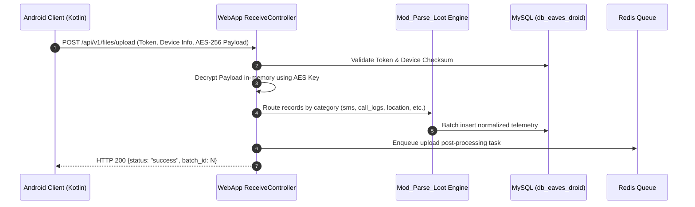
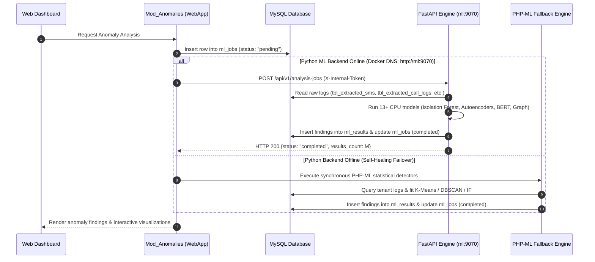
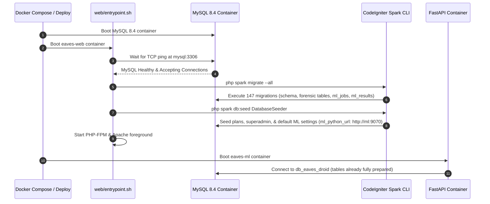
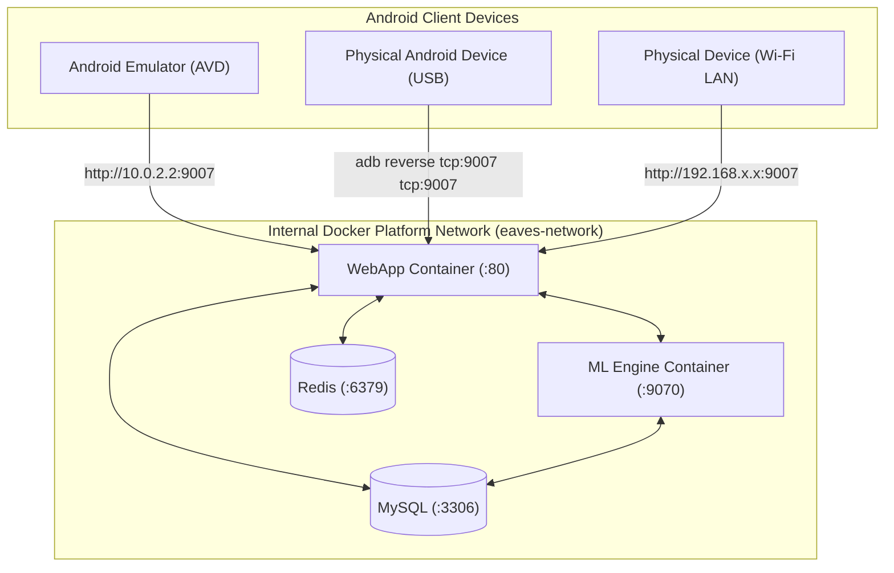

# Architecture: Inter-Service Communication

This document outlines the protocols, authentication mechanisms, sequence flows, and emulator routing connecting the Eaves Droid Platform components.

---

## 1. Communication Topology

| From | To | Protocol | Auth | Monorepo Address | Notes |
|------|----|----------|------|-------------------|-------|
| **Android Client** | WebApp Ingest | HTTPS / JSON | Token Header + AES-256 Body | `http://10.0.2.2:9007` | Emulator loopback or LAN routing |
| **Web Browser** | Web Dashboard | HTTPS / HTML | CodeIgniter Shield Session | `http://localhost:9007` | CSRF & Session protected |
| **WebApp (Heartbeat)** | ML Engine | HTTP / JSON | `X-Internal-Token` Header | `http://ml:9070` | Internal Docker DNS healthcheck |
| **WebApp (Jobs)** | ML Engine | HTTP / JSON | `X-Internal-Token` Header | `http://ml:9070` | Anomaly job execution dispatch |
| **ML Engine** | MySQL | TCP / MySQL | DB Credentials | `mysql:3306` | Direct query pool (SQLAlchemy) |
| **WebApp / ML** | Redis | TCP / RESP | None / Auth | `redis:6379` | Worker queues & response caching |
| **Pesapal v3** | WebApp | HTTPS POST | Server-to-Server IPN | `/billing/pesapal/ipn` | Payment webhook verification |

---

## 2. Sequence Diagrams

### Sequence 1: Android Forensic Data Ingestion

### Sequence 2: ML Anomaly Job Dispatch with Self-Healing Failover

### Sequence 3: Automated Container Startup, Migrations & Seeding

---

## 3. Mobile Device Networking & Routing

