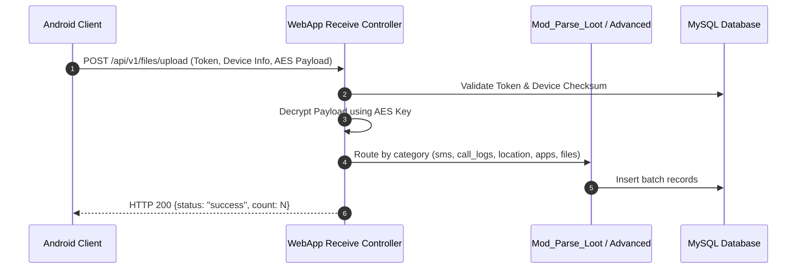
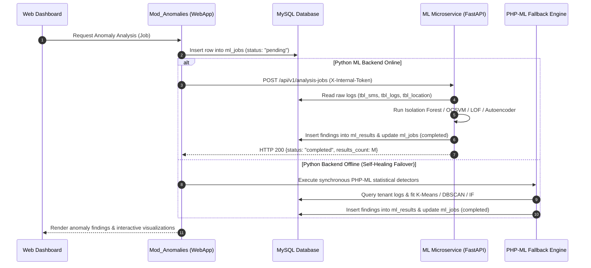
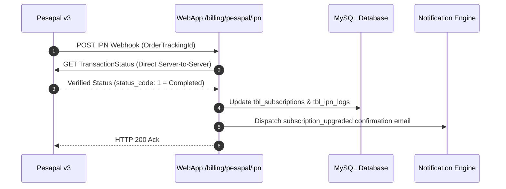
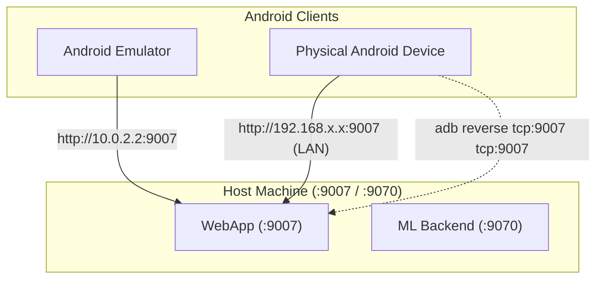

# Architecture: Inter-Service Communication

This document outlines the protocols, authentication mechanisms, sequence flows, and emulator routing connecting the Eaves Droid ecosystem components.

---

## 1. Communication Topology

| From | To | Protocol | Auth | Dev Address | Notes |
|------|----|----------|------|-------------|-------|
| Android Client | WebApp | HTTPS / JSON | Token Header + AES Body | `http://10.0.2.2:9007` | Android emulator loopback routing |
| Web Browser | WebApp | HTTPS / HTML | Shield Session Cookie | `http://localhost:9007` | CSRF protected session |
| WebApp (Heartbeat) | ML Backend | HTTP / JSON | `X-Internal-Token` Header | `http://ml-eaves-droid:9070` | Microservice container health check |
| WebApp (Jobs) | ML Backend | HTTP / JSON | `X-Internal-Token` Header | `http://ml-eaves-droid:9070` | Analysis dispatch endpoint |
| ML Backend | MySQL | TCP / MySQL | DB Credentials | `mysql:3306` | SQLAlchemy shared connection pool |
| Pesapal | WebApp | HTTPS POST | Server-to-Server IPN | `/billing/pesapal/ipn` | Payment verification webhook |

---

## 2. Sequence Diagrams

### Sequence 1: Forensic Data Ingestion

### Sequence 2: ML Anomaly Job Dispatch with Self-Healing Failover

### Sequence 3: Pesapal Subscription IPN Verification

---

## 3. Emulator & Device Networking

