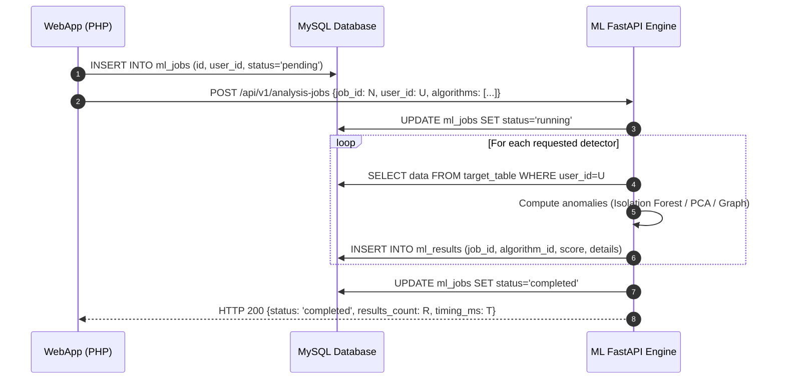

# Architecture: Communication Protocol

This document details how the CodeIgniter 4 WebApp and the ML Eaves Droid service communicate.

---

## 1. Inter-Service Endpoints

| Method | Path | Source | Destination | Description |
|--------|------|--------|-------------|-------------|
| GET | `/` | User / Proxy | ML Engine | Landing page & service identification |
| GET | `/api/health` | WebApp / Healthchecker | ML Engine | Reports engine readiness, loaded models, DB connectivity |
| GET | `/api/models` | WebApp Admin | ML Engine | Returns list of registered algorithms and default hyperparameters |
| POST | `/api/v1/analysis-jobs` | WebApp `Mod_Anomalies` | ML Engine | Dispatches analysis job execution |
| GET | `/metrics` | Prometheus | ML Engine | Prometheus metrics exporter |

---

## 2. Analysis Job Lifecycle

