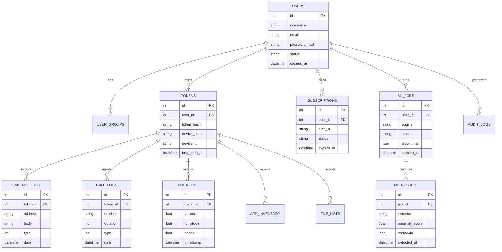

# Architecture: Data & Storage Topology

This document details the database schema, relational models, forensic storage directory layout, and data retention policies for Eaves Droid WebApp.

---

## 1. Database Schema & Entity Relationship Diagram



---

## 2. Multi-Tenant Isolation

1. **Tenant Scoping:** All forensic records (`tbl_sms`, `tbl_logs`, `tbl_location`, `tbl_installed_apps`, `tbl_files`) contain foreign keys referencing `token_id` and the user's account ID.
2. **Query Scoping:** CodeIgniter models automatically scope queries with `where('user_id', $userId)` preventing Cross-Tenant IDOR.
3. **Shield Group Protections:** Non-superadmin users are restricted from viewing data belonging to other user accounts.

---

## 3. File Storage & Directory Layout

Forensic binary uploads, chat attachments, and system caches are persisted in the `writable/` directory:

```
writable/
├── cache/                  # CodeIgniter transient query & view cache
├── exports/                # Generated forensic PDF, CSV, and JSON exports
├── logs/                   # System error logs & debug traces
├── loot/                   # Encrypted and raw extracted mobile dumps
│   └── {user_id}/
│       └── {device_id}/
├── session/                # PHP secure file session storage
├── temp/                   # Transient decompression & staging files
└── uploads/                # User avatar uploads & chat attachments
```
