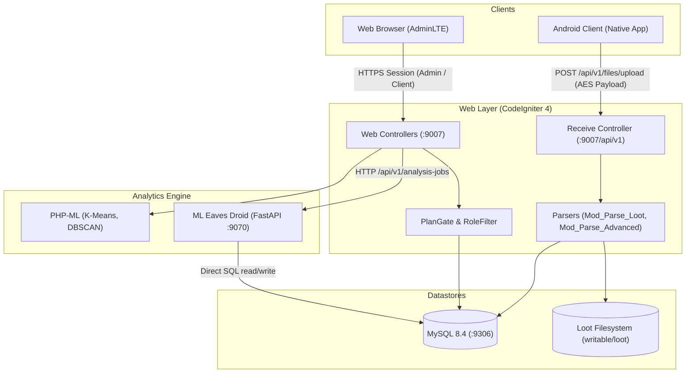

# Architecture: System Overview

Eaves Droid WebApp is the central control plane, data ingestion engine, and forensic presentation dashboard for the Eaves Droid platform.

---

## 1. System Containers & Context

---

## 2. Core Subsystems

### Ingestion & Decryption Pipeline
The native Android app extracts data on device, encrypts the payload using user-supplied AES keys, and uploads it via `POST /api/v1/files/upload`. The `Receive` controller:
1. Verifies authentication tokens against `tbl_tokens`.
2. Decrypts the forensic payload.
3. Routes the decoded JSON to either `Mod_Parse_Loot` (legacy categories) or `Mod_Parse_Advanced` (advanced device telemetry).
4. Persists records into dedicated category tables in MySQL.

### Access Control (Shield RBAC)
Managed through CodeIgniter Shield across 5 groups and 17 granular permissions:
* `superadmin`: Fleet management, plan pricing diffs, impersonation, forensic exports.
* `admin`: User CRUD, ML settings, remote device command dispatch.
* `developer`: Debugging tools, settings, technical inspection.
* `user`: Default group for device owners; data dashboards and analysis.
* `beta`: Early access to experimental features.

### Subscription & Plan Gate (`PlanGate`)
Three subscription tiers (Free, Gold, Platinum) enforce quotas:
* **Max Devices:** 1 (Free), 3 (Gold), 10 (Platinum).
* **Data History:** 10 days (Free), 60 days (Gold), 180 days (Platinum).
* **Algorithm Tiers:** `core` (Free), `core+advanced` (Gold), `core+advanced+deep` (Platinum).
* **Payment Processing:** Integrated with Pesapal v3 (M-Pesa STK push, cards, IPN verification at `/billing/pesapal/ipn`).

### Analytics Dispatch
* In-process analytics run using **PHP-ML** (K-Means clustering on SMS senders, DBSCAN on trajectory coordinates).
* Deep anomaly detection runs asynchronously in the **ML Eaves Droid** service. The WebApp creates a job row in `ml_jobs` and notifies FastAPI, which queries the database directly.
