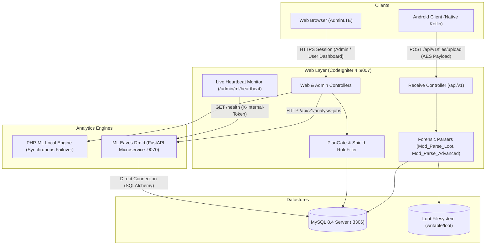

# Architecture: System Overview

Eaves Droid WebApp is the central control plane, forensic data ingestion gateway, and analytics presentation dashboard for the Eaves Droid platform.

---

## 1. System Containers & Context

---

## 2. Core Subsystems

### Ingestion & Decryption Pipeline
The native Android client extracts forensic telemetry on device, encrypts the payload using user-configured AES keys, and uploads it via `POST /api/v1/files/upload`. The `Receive` controller:
1. Verifies API tokens against `tbl_tokens`.
2. Decrypts the forensic payload.
3. Routes decoded JSON into dedicated parsers: `Mod_Parse_Loot` (legacy categories) and `Mod_Parse_Advanced` (advanced device telemetry).
4. Persists records into dedicated category tables in MySQL.

### Access Control (Shield RBAC & SuperAdmin)
Managed through CodeIgniter Shield across 5 groups and granular permissions:
* `superadmin`: Fleet management, role matrix promotion/demotion, token management, 1-click user impersonation, forensic exports.
* `admin`: User CRUD, ML settings, detection engines, remote device command dispatch.
* `developer`: Debugging utilities, raw database inspection, SQL queries.
* `user`: Default group for device owners; access to private dashboards, timeline, correlation, and data explorer.
* `beta`: Early access to experimental algorithms and views.

### Subscription & Plan Gate (`PlanGate`)
Three subscription tiers (Free, Gold, Platinum) enforce quotas:
* **Max Devices:** 1 (Free), 3 (Gold), 10 (Platinum).
* **Data History:** 10 days (Free), 60 days (Gold), 180 days (Platinum).
* **Algorithm Tiers:** `core` (Free), `core+advanced` (Gold), `core+advanced+deep` (Platinum).
* **Payment Processing:** Integrated with Pesapal v3 (M-Pesa STK push, card processing, IPN verification at `/billing/pesapal/ipn`).

### Dual-Engine Analytics & Self-Healing Failover
1. **Primary Engine:** Python FastAPI microservice executing CPU/GPU-accelerated models (Isolation Forest, One-Class SVM, Local Outlier Factor, PCA reconstruction, MLP Activity sequence predictor, Deep Autoencoders).
2. **Failover Engine:** Built-in PHP-ML executing synchronous statistical clustering (K-Means, DBSCAN, Isolation Forest) if the Python microservice is unreachable.
3. **Telemetry & Heartbeat:** Active health polling checks container CPU, RAM, active detectors, and database connectivity.

---

## 3. Sibling Ecosystem Repositories

| Component | Responsibility | Repository URL | Documentation |
|---|---|---|---|
| **Web App** | CodeIgniter 4 Web UI, Auth, Billing & Ingestion | [GitHub Repo](https://github.com/Niccher/Eaves-Droid-WebApp) | [docs/](../README.md) |
| **ML Microservice** | FastAPI, scikit-learn, PyOD, PyTorch & Deep Autoencoders | [GitHub Repo](https://github.com/Niccher/ML-Eaves-Droid) | [docs/](https://github.com/Niccher/ML-Eaves-Droid/tree/main/docs) |
| **Android Client** | Kotlin Native App, 60+ Forensic Extractors & AES Upload | [GitHub Repo](https://github.com/Niccher/Eaves-Droid-App) | [docs/](https://github.com/Niccher/Eaves-Droid-App/tree/main/docs) |
