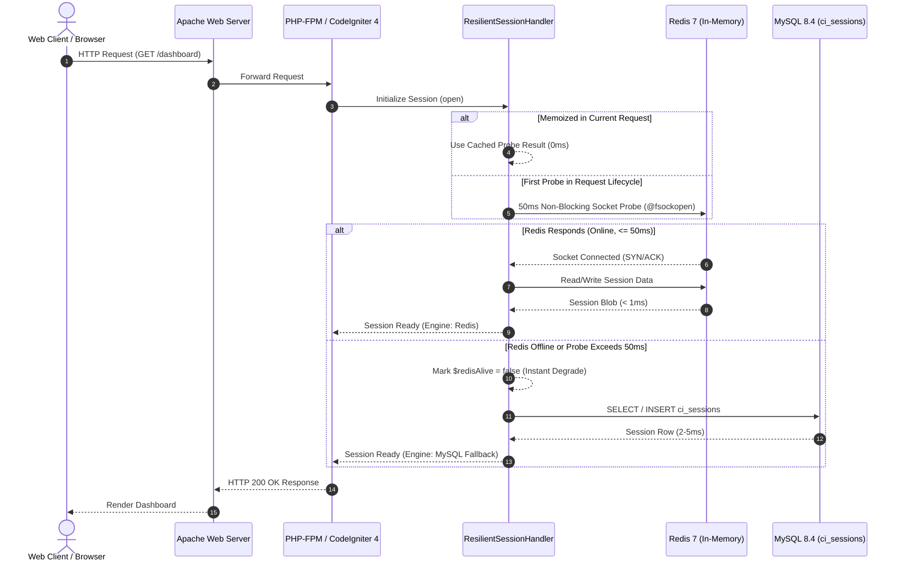

# Dual-Engine High-Availability Fallback & Ecosystem Resilience

This document specifies the fault-tolerant, self-healing **Dual-Engine High-Availability Architecture** implemented across the **Eaves Droid Platform**.

---

## 1. Architectural Philosophy

Under standard production operations, performance is paramount:
* Web user sessions, rate-limit state, and application caches execute in-memory via **Redis 7** at sub-millisecond speeds (< 1ms).

However, distributed systems inevitably encounter transient infrastructure faults:
* Redis container restarts, cloud maintenance events, network partitioning, or out-of-memory crashes.

Rather than propagating `500 Internal Server Error` responses, logging out active users, or corrupting state, the platform incorporates a transparent **Dual-Engine Failover System**:
1. **Pre-flight Socket Probe (50ms Ceiling)**: The application inspects Redis socket availability in $\le 50\text{ ms}$ via non-blocking `@fsockopen` before attempting I/O operations.
2. **Transparent MySQL Session Failover**: If Redis is offline or slow, user sessions silently route to MySQL relational storage (`ci_sessions`).
3. **Transparent File Cache Failover**: Application caches route to local disk storage (`writable/cache/`).
4. **Autonomous Self-Healing**: The moment Redis recovers, the application immediately and silently re-engages in-memory acceleration without service restarts or manual sysadmin intervention.

---

## 2. Dual-Engine Decision Matrix

| Engine Layer | Primary Driver (Redis Online) | Fallback Driver (Redis Offline) | Destination Storage | Latency Profile |
| :--- | :--- | :--- | :--- | :--- |
| **User Sessions** | `RedisHandler` (In-Memory RAM) | `DatabaseHandler` (MySQL Table) | `tcp://redis:6379` $\to$ `ci_sessions` | $<1\text{ ms}$ (Redis) vs $2\text{--}5\text{ ms}$ (MySQL) |
| **Application Cache** | `RedisHandler` (In-Memory RAM) | `FileHandler` (Local Disk) | Redis RAM $\to$ `writable/cache/` | $<1\text{ ms}$ (Redis) vs $1\text{--}2\text{ ms}$ (File) |
| **Failover Trigger** | Non-blocking Socket Probe | Automatic after 50ms timeout | Memory Switch | Instantaneous ($\le 50\text{ ms}$) |
| **Self-Healing** | Automatic Next HTTP Request | Automatic Probe Verification | RAM Re-engagement | $0\text{s}$ (Zero downtime / Zero restart) |

---

## 3. Mermaid Sequence: Resilient Decision Loop



---

## 4. Operational Runbook: Garbage Collection During Fallbacks

When operating under extended Redis downtime, session blobs accumulate in the MySQL `ci_sessions` table. Run the garbage collection command to prune expired sessions:

```bash
# Dry run to inspect expired session count
docker compose exec web php spark session:gc --dry-run

# Live purge expired sessions older than default TTL (30 days)
docker compose exec web php spark session:gc

# Custom TTL purge (e.g. sessions older than 7 days = 604800s)
docker compose exec web php spark session:gc --max-age=604800
```

---

## 5. Live Resilience Telemetry Endpoint

Inspect the health of both engines in real time via:
```bash
curl -s http://localhost:9007/health | jq .resilience
```

Example Output:
```json
{
  "failover_configured": true,
  "redis_probe_ms": 0.42,
  "redis_status": "connected",
  "session_engine": "redis",
  "cache_engine": "redis",
  "fallback_active": false,
  "timestamp": 1788300000
}
```
