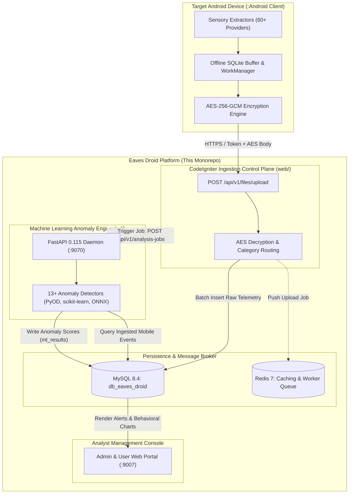

# Ecosystem: Android Client Dependency & Integration

This document specifies the direct architectural and operational dependency between the **Eaves Droid Platform** (Ingestion & ML Analytics) and the **Android Client Application** ([`Niccher/Eaves-Droid-App`](https://github.com/Niccher/Eaves-Droid-App)).

---

## 1. Architectural Relationship

The Eaves Droid ecosystem operates as an asymmetric client-server surveillance analytics platform:



* **The Android Client is the Sensory Producer:** The platform server cannot self-generate telemetry. It relies completely on the Android app running on monitored devices to extract, buffer, and securely upload device state.
* **The Platform Server is the Ingestor & Intelligence Processor:** The platform validates incoming device checksums, decrypts AES payloads, normalizes JSON data across 60+ forensic categories into structured MySQL tables, and invokes the Python ML engine to surface anomalous behaviors.

---

## 2. Forensic Telemetry Pipeline & Category Mappings

The Android client periodically extracts and batches telemetry across 60+ distinct providers. Below is the mapping between Android extractors and platform database destinations:

| Category Family | Android Extractor Class | Target MySQL Table | Analyzed by ML Detector |
|---|---|---|---|
| **SMS & Messaging** | `SmsExtractor.kt`, `MmsExtractor.kt` | `tbl_extracted_sms` | `sms_bert`, `communication_spikes`, `semantic_relationship` |
| **Call Logs** | `CallLogExtractor.kt` | `tbl_extracted_call_logs` | `calls_isolation`, `communication_spikes` |
| **Contacts & Social** | `ContactsExtractor.kt` | `tbl_extracted_contacts` | `contacts_graph` |
| **Notifications** | `NotificationService.kt` | `tbl_extracted_notifications` | `notification_hijack` |
| **Installed Apps** | `InstalledAppsExtractor.kt` | `tbl_extracted_installed_apps` | `apps_autoencoder`, `accessibility_abuse` |
| **App Usage & Foreground** | `UsageStatsExtractor.kt` | `tbl_system_app_usage` | `activity_lstm` |
| **Geospatial GPS** | `LocationExtractor.kt` | `tbl_extracted_locations` | `spyware_drain`, `lifestyle_analysis` |
| **Battery & Power** | `BatteryTelemetry.kt` | `tbl_telemetry_battery_stats` | `battery_drain`, `spyware_drain` |
| **Running Processes** | `ProcessExtractor.kt` | `tbl_system_running_processes` | `background_exfiltration` |
| **Accessibility Services** | `AccessibilityExtractor.kt` | `tbl_system_accessibility_services` | `accessibility_abuse` |
| **Media & Files** | `FileWatcherExtractor.kt` | `tbl_extracted_media_files` | `files_entropy` |
| **Device Hardware** | `DeviceProfileExtractor.kt` | `tbl_device_profiles` | `device_oneclass` |

---

## 3. Cryptography & Security Protocol

1. **Zero-Knowledge On-Device Encryption:**
   All logs extracted on the device are serialized to JSON and encrypted using **AES-256-GCM** with a device-specific derived key before network transmission.
2. **Payload Envelope Format:**
   ```json
   {
     "device_id": "8f39a1c2-d3e4-4a5b-9c8d-1e2f3a4b5c6d",
     "device_checksum": "a3b2c1d0...",
     "category": "sms",
     "encrypted_payload": "<Base64 encoded AES-256-GCM ciphertext>",
     "iv": "<Base64 encoded 12-byte initialization vector>",
     "tag": "<Base64 encoded 16-byte authentication tag>",
     "client_timestamp": 1788300000000
   }
   ```
3. **Server Ingestion Decryption:**
   * When `POST /api/v1/files/upload` receives the payload, [`ReceiveController.php`](file:///home/niccher/Music/hosts/Eaves%20Droid%20Platform/web/app/Controllers/api/v1/ReceiveController.php) validates the authorization token in `tbl_user_api_tokens`.
   * The controller verifies the device pairing status and uses the shared AES key to decrypt the payload in-memory.
   * Extracted records are batch-inserted into the corresponding forensic table.

---

## 4. Local Emulator & Device Routing

When testing with Android Virtual Devices (AVD) or physical devices over USB/LAN:

| Connection Type | Target URL in Android Settings | Setup Command / Note |
|---|---|---|
| **Android Emulator** | `http://10.0.2.2:9007` | Automatic Android emulator loopback routing to host |
| **Physical Device (USB)** | `http://localhost:9007` | Requires `adb reverse tcp:9007 tcp:9007` |
| **Physical Device (Wi-Fi)**| `http://192.168.x.x:9007` | Requires host machine IP accessible on local Wi-Fi |

---

## 5. Version Compatibility Matrix

| Platform Monorepo Version | Ingestion API Version | Min Compatible Android Client | ML Detector Engine Version |
|---|---|---|---|
| **3.0.0 (Current)** | `v1` | **v2.8.1+** | **v3.0.0** |
| 2.9.1 | `v1` | v2.8.0 | v2.5.1 |
| 2.8.0 | `v1` | v2.7.0 | v2.5.0 |

> [!IMPORTANT]
> If Android Client is updated with new forensic extractors, corresponding database columns must be added to CodeIgniter migrations in `web/app/Database/Migrations/` before deploying the mobile update.
