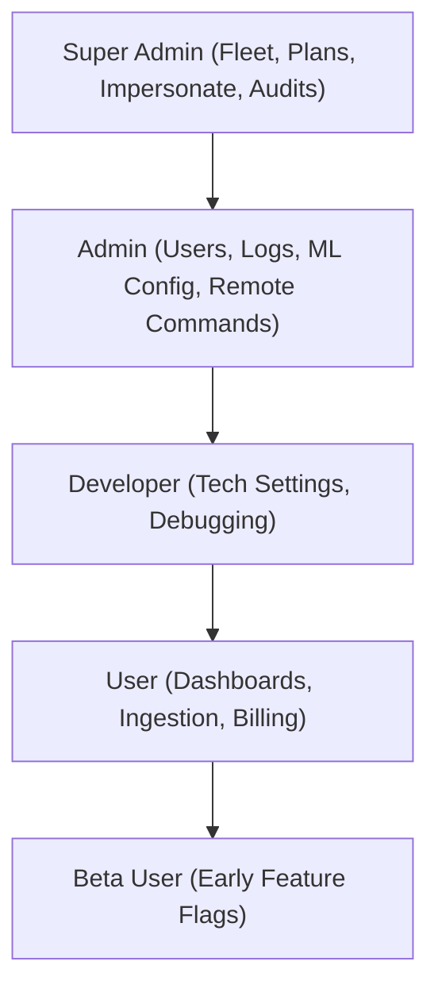

# Engineering: Security & Access Control

This document describes the security architecture, Shield RBAC implementation, multi-tenant data isolation, and payment security in the Eaves Droid WebApp.

---

## 1. Role-Based Access Control (Shield)

The application utilizes **CodeIgniter Shield** to enforce access policies across 5 groups:

### Route-Level Enforcement (`RoleFilter`)
Defined in `app/Filters/RoleFilter.php`. Intercepts incoming requests and evaluates current session groups:
* `/superadmin/**` requires `superadmin` role.
* `/admin/**` requires `admin` or `superadmin`.
* Client forensic routes require active authenticated `user` session.

---

## 2. Multi-Tenant Isolation & IDOR Prevention

1. **User Scoping:** Every forensic query executes with `WHERE user_id = :userId:` matching the authenticated session ID.
2. **Device Ownership Check:** When viewing forensic data, device checksums are cross-referenced with `tbl_devices` to verify registration to the requesting user.
3. **Superadmin Impersonation:** Regulated via `ImpersonateFilter`. Session transitions are recorded in the security audit log (`tbl_audit_logs`).

---

## 3. Payment & Webhook Security (Pesapal v3)

* **PCI-DSS Compliance:** The WebApp never stores raw payment card numbers or mobile PINs. Checkouts redirect to Pesapal's hosted modal or trigger STK pushes.
* **Server-to-Server Verification:** The IPN endpoint at `/billing/pesapal/ipn` does not trust payload status blindly. Upon receiving an IPN notification, the backend issues an authenticated server-to-server query to Pesapal's API to confirm the actual payment state before provisioning subscription upgrades.
